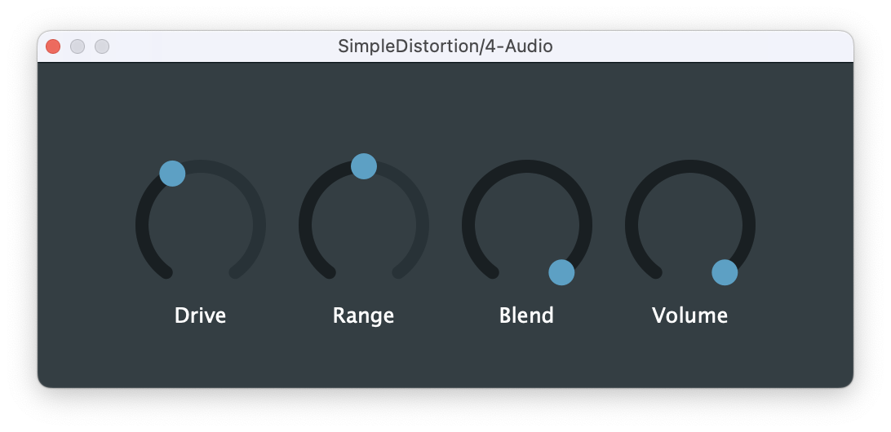

## SimpleDistortion

Code Repository for [Audio Processing Tutorial: How To Create an AWESOME Distortion VST/AU Plugin In C++ (JUCE Framework)](https://www.youtube.com/watch?v=iNCR5flSuDs) by Reon Fourie

    

[⬇️ Download SimpleDistortion VST Plugin ](https://github.com/Digitopia/SimpleDistortion/releases/download/v1/SimpleDistortion.vst3.zip)
